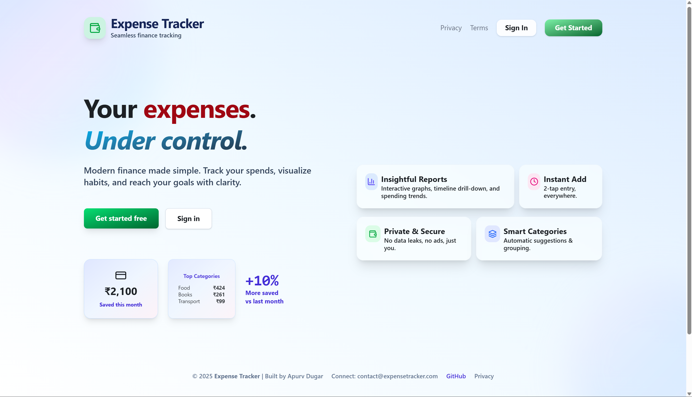
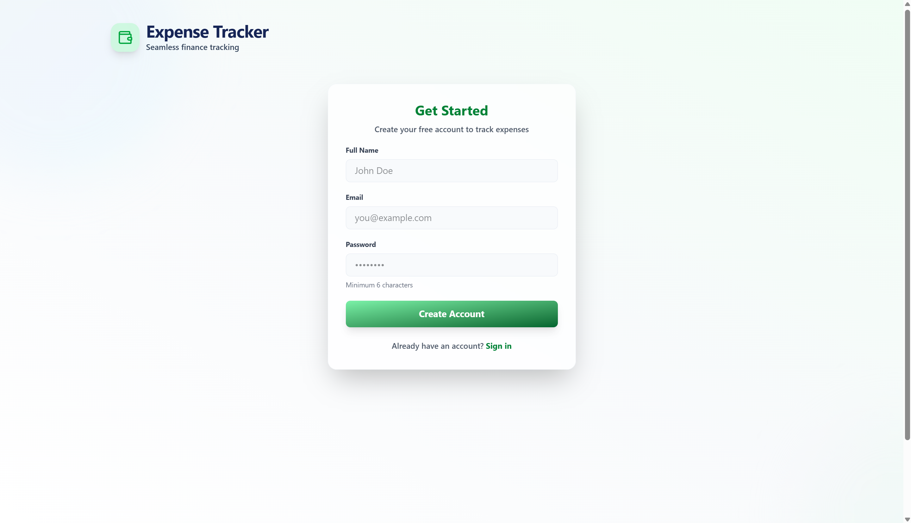
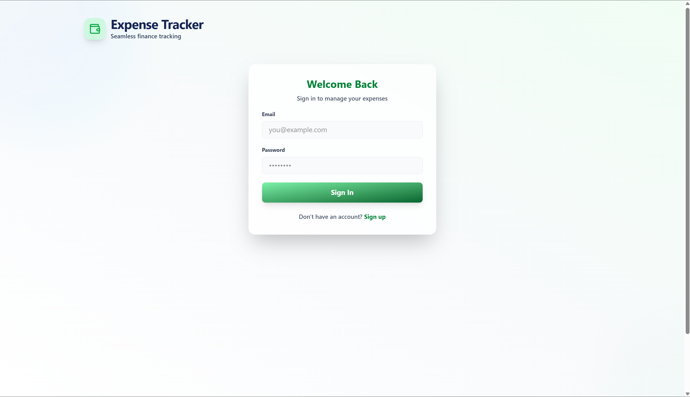
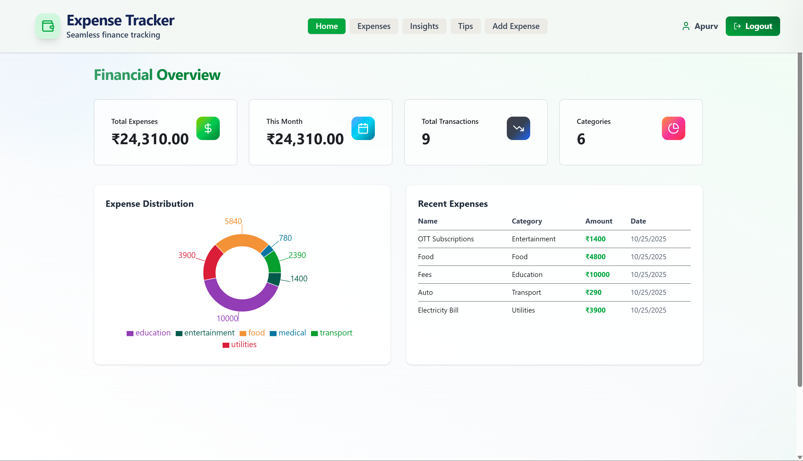
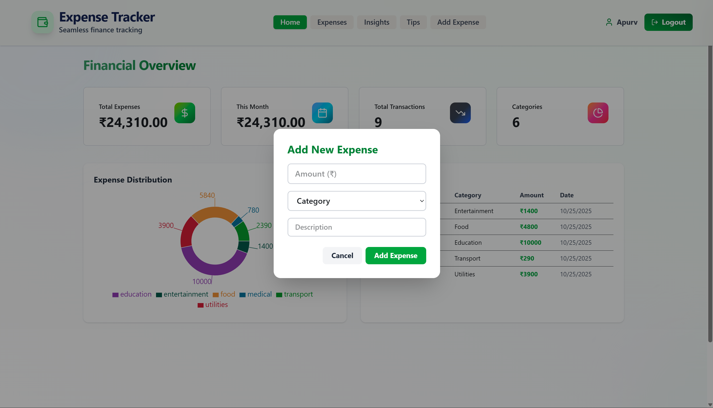
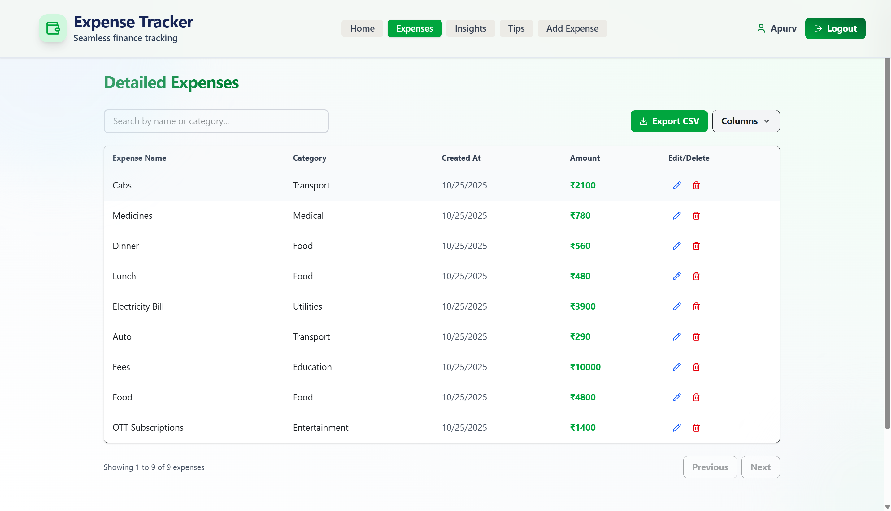
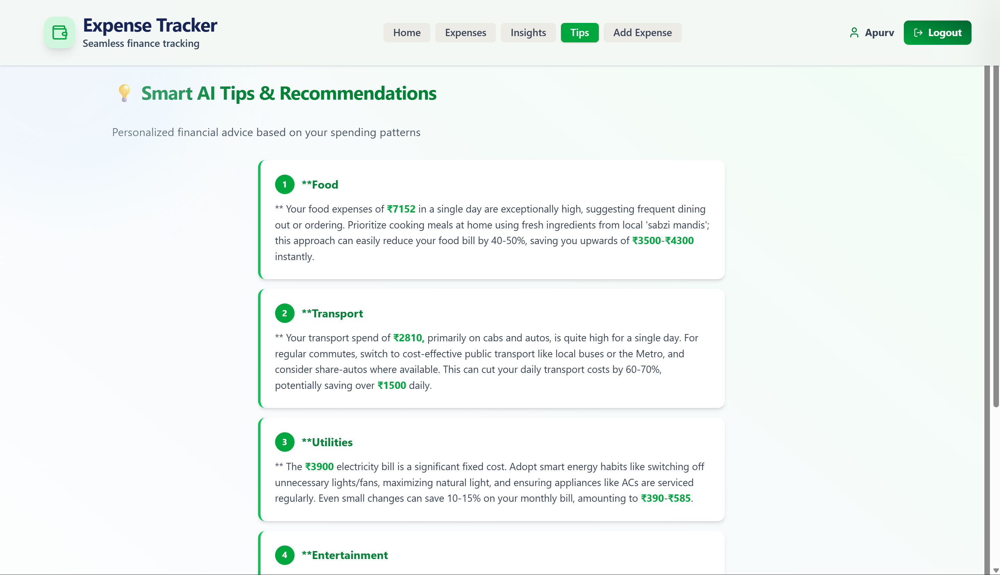
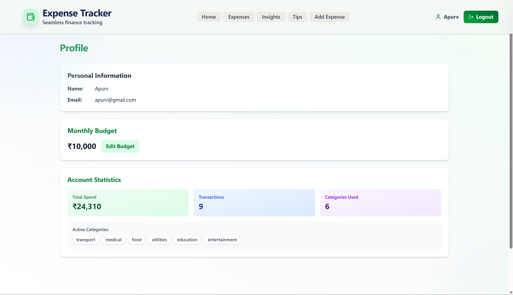

# 💰 Expense Tracker — Modern MERN Stack Application

> **Manage your personal finances effortlessly. Analyze, visualize, and control your expenses — all in a beautiful, responsive, and secure platform.**

---

## 📋 Table of Contents

- [Overview](#-overview)
- [Features](#-features)
- [Tech Stack](#-tech-stack)
- [Project Structure](#-project-structure)
- [Installation](#-installation)
- [Configuration](#-configuration)
- [Running the Application](#-running-the-application)
- [Usage Guide](#-usage-guide)
- [API Endpoints](#-api-endpoints)
- [Screenshots](#-screenshots)
- [Deployment](#-deployment)
- [Contributing](#-contributing)
- [Author](#-author)
- [License](#-license)

---

## 🌟 Overview

**Expense Tracker** is a full-stack web application built with the **MERN stack** (MongoDB, Express.js, React.js, Node.js). It empowers users to take control of their finances by providing tools to:

- Register and authenticate securely
- Record and categorize expenses with ease
- Visualize spending patterns through interactive charts
- Set and track monthly budgets
- Export financial data for external analysis
- Receive AI-powered financial tips

The application features a modern, glassmorphic UI with responsive design, making financial management accessible from any device.

---

## ✨ Features

### 🔐 User Authentication
- Secure signup and login with **JWT-based authentication**
- Password encryption using **bcrypt**
- Session management with HTTP-only cookies
- Protected routes for authorized access

### 💳 Expense Management
- **Add, edit, and delete** expenses in real-time
- Categorize expenses (Food, Transport, Shopping, Utilities, Education, Medical, Entertainment, Other)
- Toast notifications for all actions
- Expense validation and error handling

### 📊 Analytics & Insights
- **Dashboard Overview**: Total expenses, monthly spend, transaction count, category breakdown
- **Interactive Charts**: Pie charts, trend graphs, and category visualizations
- **Recent Transactions**: Quick view of latest expenses
- **Budget Progress**: Track spending against monthly budget goals

### 📈 Financial Reporting
- **CSV Export**: Download complete transaction history
- **Monthly Comparisons**: Compare spending across different months
- **Top Categories**: Identify highest spending areas
- **Large Transactions**: Monitor significant expenses

### 🤖 AI-Powered Tips
- Personalized financial advice based on spending patterns
- Smart recommendations for budget optimization
- Category-specific savings suggestions

### 🎨 Modern UI/UX
- Glassmorphism design with animated backgrounds
- Fully responsive (mobile, tablet, desktop)
- Loading states and skeleton screens
- Smooth transitions and animations
- Dark mode support via Radix UI themes

### 🔒 Privacy & Security
- GDPR-compliant privacy policy
- Clear terms of service
- Secure data storage and transmission
- No third-party data sharing

---

## 🛠️ Tech Stack

### Frontend
| Technology | Purpose |
|------------|---------|
| **React 18.x** | UI library for building interactive interfaces |
| **Vite** | Fast build tool and dev server |
| **React Router** | Client-side routing and navigation |
| **Radix UI** | Accessible, unstyled component primitives |
| **Tailwind CSS** | Utility-first CSS framework |
| **Lucide Icons** | Beautiful, consistent icon set |
| **react-hot-toast** | Toast notifications |
| **Recharts / Custom SVG** | Data visualization |

### Backend
| Technology | Purpose |
|------------|---------|
| **Node.js** | JavaScript runtime environment |
| **Express.js** | Web application framework |
| **MongoDB** | NoSQL database for data storage |
| **Mongoose** | ODM for MongoDB |
| **JWT** | JSON Web Tokens for authentication |
| **bcryptjs** | Password hashing |
| **Zod** | Schema validation |
| **CORS** | Cross-Origin Resource Sharing |

### Development & Deployment
| Tool | Purpose |
|------|---------|
| **Render** | Backend hosting and deployment |
| **Vercel/Netlify** | Frontend hosting and deployment |
| **MongoDB Atlas** | Cloud-hosted MongoDB database |
| **Git & GitHub** | Version control |

---

## 📁 Project Structure

```
expense-tracker/
├── backend/
│   ├── controllers/
│   │   ├── authController.js       # Authentication logic
│   │   ├── expenseController.js    # Expense CRUD operations
│   │   └── userController.js       # User profile & budget
│   ├── models/
│   │   ├── User.js                 # User schema
│   │   └── Expense.js              # Expense schema
│   ├── routes/
│   │   ├── authRoutes.js           # Auth endpoints
│   │   ├── expenseRoutes.js        # Expense endpoints
│   │   └── userRoutes.js           # User endpoints
│   ├── middleware/
│   │   ├── isAuth.js               # Authentication middleware
│   │   └── errorHandler.js         # Error handling
│   ├── validators/
│   │   └── expenseValidator.js     # Input validation
│   ├── config/
│   │   └── db.js                   # Database connection
│   ├── utils/
│   │   └── token.js                # JWT utilities
│   ├── .env                        # Environment variables
│   ├── server.js                   # Entry point
│   └── package.json
│
└── frontend/
    ├── src/
    │   ├── components/
    │   │   ├── Dashboard/          # Dashboard components
    │   │   ├── Insights/           # Analytics components
    │   │   ├── Layout/             # Layout components (Navbar, etc.)
    │   │   └── ToastProvider.jsx   # Toast configuration
    │   ├── pages/
    │   │   ├── Landing.jsx         # Landing page
    │   │   ├── Login.jsx           # Login page
    │   │   ├── Signup.jsx          # Signup page
    │   │   ├── Dashboard.jsx       # Main dashboard
    │   │   ├── Expenses.jsx        # Expense management
    │   │   ├── Insights.jsx        # Analytics page
    │   │   ├── Profile.jsx         # User profile
    │   │   ├── Tips.jsx            # AI tips page
    │   │   ├── Privacy.jsx         # Privacy policy
    │   │   └── Terms.jsx           # Terms of service
    │   ├── contexts/
    │   │   └── AuthContext.jsx     # Authentication context
    │   ├── App.jsx                 # Main app component
    │   ├── main.jsx                # Entry point
    │   └── App.css                 # Global styles
    ├── public/
    ├── .env                        # Environment variables
    ├── vite.config.js              # Vite configuration
    └── package.json
```

---

## 📦 Installation

### Prerequisites

- **Node.js** (v16.x or higher) - [Download](https://nodejs.org/)
- **MongoDB Atlas Account** - [Sign up](https://www.mongodb.com/cloud/atlas)
- **npm** or **yarn** package manager
- **Git** - [Download](https://git-scm.com/)

### Clone the Repository

```bash
git clone https://github.com/apurvdugar/Expense-Tracker-App.git
cd expense-tracker
```

### Install Dependencies

#### Backend
```bash
cd backend
npm install
```

#### Frontend
```bash
cd frontend
npm install
```

---

## ⚙️ Configuration

### Backend Environment Variables

Create a `.env` file in the `backend` directory:

```env
# Server Configuration
PORT=5000
NODE_ENV=development

# Database
MONGODB_URI=mongodb+srv://<username>:<password>@cluster.mongodb.net/expense-tracker?retryWrites=true&w=majority

# Authentication
JWT_SECRET=your_super_secret_jwt_key_here
JWT_EXPIRE=30d

# CORS
FRONTEND_URL=http://localhost:5173
```

### Frontend Environment Variables

Create a `.env` file in the `frontend` directory:

```env
VITE_API_BASE_URL=http://localhost:5000
```

### MongoDB Atlas Setup

1. Create a MongoDB Atlas account at [mongodb.com/cloud/atlas](https://www.mongodb.com/cloud/atlas)
2. Create a new cluster (free tier available)
3. Set up database access (username/password)
4. Whitelist your IP address or allow access from anywhere (0.0.0.0/0)
5. Get your connection string and add it to `MONGODB_URI`

---

## 🚀 Running the Application

### Development Mode

#### 1. Start the Backend Server

```bash
cd backend
npm run dev
```

Server will run on `http://localhost:5000`

#### 2. Start the Frontend Development Server

```bash
cd frontend
npm run dev
```

Frontend will run on `http://localhost:5173`

### Production Build

#### Backend
```bash
cd backend
npm start
```

#### Frontend
```bash
cd frontend
npm run build
npm run preview
```

---

## 📖 Usage Guide

### Getting Started

1. **Sign Up**
   - Navigate to the signup page
   - Enter your name, email, and password (minimum 6 characters)
   - Click "Create Account"

2. **Sign In**
   - Enter your registered email and password
   - Click "Sign In"
   - You'll be redirected to the dashboard

### Managing Expenses

#### Add Expense
- Click the **"+ Add Expense"** button in the navbar
- Fill in:
  - Amount (in ₹)
  - Category (dropdown)
  - Description (optional, max 100 characters)
- Click "Add Expense"
- Toast notification confirms success

#### Edit Expense
- Go to the **Expenses** page
- Click the edit icon (✏️) next to any expense
- Modify details in the modal
- Click "Save Changes"

#### Delete Expense
- Go to the **Expenses** page
- Click the delete icon (🗑️) next to any expense
- Confirm deletion in the modal

### Dashboard Features

- **Total Expenses**: Lifetime spending total
- **This Month**: Current month's expenses
- **Total Transactions**: Number of recorded expenses
- **Categories**: Number of unique categories used
- **Expense Distribution**: Pie chart of category breakdown
- **Recent Expenses**: Last 5 transactions

### Insights & Analytics

- **Monthly Total**: Current month spending
- **Highest/Lowest Expense**: Largest and smallest transactions
- **Category Distribution**: Visual breakdown by category
- **Spending Trend**: Daily spending pattern graph
- **Top Categories**: Ranking of spending by category
- **Budget Progress**: Visual budget vs. actual spending
- **Large Transactions**: Notable expenses to watch
- **Month Comparison**: Current vs. previous month

### Profile Management

- View personal information (name, email)
- Set monthly budget
- Edit budget with real-time update
- View account statistics:
  - Total spend
  - Transaction count
  - Active categories

### Export Data

- Navigate to **Expenses** or **Insights** page
- Click **"Export CSV"** button
- Download complete transaction history
- Open in Excel, Google Sheets, or any spreadsheet software

### AI Financial Tips

- Visit the **Tips** page from navbar
- View personalized recommendations based on your spending
- Get category-specific advice
- Learn about savings opportunities

---

## 🔌 API Endpoints

### Authentication

| Method | Endpoint | Description |
|--------|----------|-------------|
| POST | `/api/auth/signup` | Register new user |
| POST | `/api/auth/signin` | Login user |

### Expenses

| Method | Endpoint | Description | Auth Required |
|--------|----------|-------------|---------------|
| GET | `/api/expenses` | Get all user expenses | ✅ |
| POST | `/api/expenses` | Create new expense | ✅ |
| PUT | `/api/expenses/:id` | Update expense | ✅ |
| DELETE | `/api/expenses/:id` | Delete expense | ✅ |

### User

| Method | Endpoint | Description | Auth Required |
|--------|----------|-------------|---------------|
| GET | `/api/user/budget` | Get user budget | ✅ |
| PUT | `/api/user/budget` | Update user budget | ✅ |

---

## 📸 Screenshots

### Landing Page


### Signup 


### Signin


### Dashboard


### Add Expense Modal


### Expenses Management


### Insights & Analytics


### Smart AI Tips


### Profile Page


---

## 🌐 Deployment

### Backend (Render)

1. Create account on [Render](https://render.com/)
2. Create new **Web Service**
3. Connect GitHub repository
4. Configure:
   - **Build Command**: `npm install`
   - **Start Command**: `npm start`
   - **Environment Variables**: Add all from `.env`
5. Deploy

### Frontend (Vercel)

1. Create account on [Vercel](https://vercel.com/)
2. Import GitHub repository
3. Configure:
   - **Framework Preset**: Vite
   - **Build Command**: `npm run build`
   - **Output Directory**: `dist`
   - **Environment Variables**: Add `VITE_API_BASE_URL`
4. Deploy

### Update Frontend with Backend URL

After backend deployment, update `VITE_API_BASE_URL` in Vercel to your Render URL.

---

### Code Style Guidelines

- Use ES6+ syntax
- Follow Airbnb JavaScript Style Guide
- Write meaningful commit messages
- Add comments for complex logic
- Test thoroughly before submitting PR

---

## 👨‍💻 Author

**Apurv Dugar**

- 🎓 Computer Science Undergraduate at Scaler School of Technology, Bengaluru
- 🔗 GitHub: [@apurvdugar](https://github.com/apurvdugar)
- 📧 Email: dugarapurv@gmail.com
- 💼 LinkedIn: [Apurv Dugar](https://www.linkedin.com/in/apurv-dugar-816934274/)

---

## 📄 License

This project is licensed under the **MIT License** - see the [LICENSE](LICENSE) file for details.

---

## 🙏 Acknowledgments

- [React](https://reactjs.org/) - UI Library
- [Radix UI](https://www.radix-ui.com/) - Accessible Component Primitives
- [Tailwind CSS](https://tailwindcss.com/) - Utility-First CSS Framework
- [Lucide Icons](https://lucide.dev/) - Beautiful Icon Set
- [Mongoose](https://mongoosejs.com/) - MongoDB ODM
- [Express.js](https://expressjs.com/) - Backend Framework
- [react-hot-toast](https://react-hot-toast.com/) - Toast Notifications

---

## ⭐️ For Reviewers

### Key Technical Highlights

✅ **Full-Stack MERN Architecture** - Complete separation of concerns with RESTful API design

✅ **Secure Authentication** - JWT-based auth with bcrypt password hashing and HTTP-only cookies

✅ **Data Validation** - Zod schema validation on both frontend and backend

✅ **Responsive Design** - Mobile-first approach with Tailwind CSS

✅ **State Management** - React Context API for global state

✅ **Error Handling** - Comprehensive error handling with user-friendly messages

✅ **Code Organization** - Clean, modular code structure following best practices

✅ **Real-Time Updates** - Optimistic UI updates with toast notifications

✅ **Data Visualization** - Custom charts and graphs for financial insights

✅ **Production Ready** - Deployed on Render (backend) and Vercel (frontend)

---

**Thank you !** 🚀
